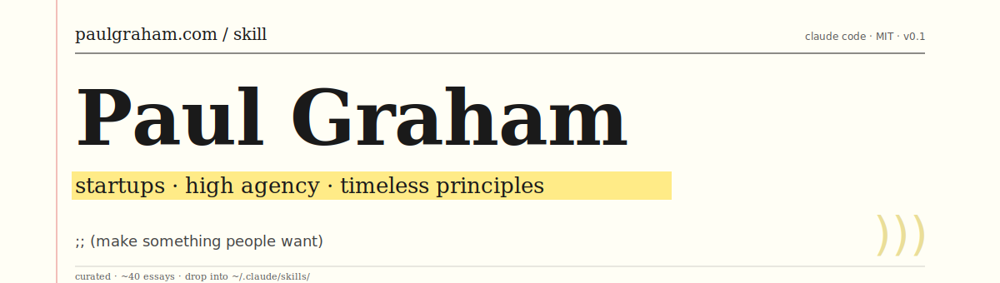

<p align="center">
  
</p>

# claude-skill-paul-graham

> A Claude Code skill that turns Paul Graham's essays on startups and high
> agency into an on-demand advisor.

Ask Claude *"should I quit my job to start a company?"* and this skill pulls
the right PG essay, quotes the relevant line, and links you to the original.

No marketing fluff. Just navigation by **intent** instead of by title.

## What this is

Paul Graham has written ~225 essays at [paulgraham.com](https://www.paulgraham.com/articles.html).
They are some of the most useful writing on startups, founders, and high
agency that exists — and they are completely unsearchable by what you
actually need.

This repo distills ~40 of them, organized by theme, with explicit
**trigger rules** so Claude can match user questions to ideas without
the user having to remember which essay said what.

## What's inside

```
skills/paul-graham/
├── SKILL.md
└── references/
    ├── INDEX.md           # master list of all curated essays
    ├── high-agency.md     # ambition, agency, doing things that don't scale
    ├── startup-ideas.md   # finding, validating, schlep blindness
    ├── founders.md        # what makes a great founder
    ├── growth.md          # startup = growth; doing things that don't scale
    ├── fundraising.md     # raising money without losing your mind
    ├── product.md         # make something people want
    ├── mental-models.md   # top idea in your mind, taste, life is short
    └── SOURCES.md
```

Each essay entry has:
- **Canonical URL** at paulgraham.com
- **One-line thesis** (our synthesis)
- **Key excerpt** (≤90 words, fair-use)
- **When this applies** — concrete situations the skill should surface it

## Install

### As a user-level skill (available everywhere)

```bash
git clone https://github.com/lonexreb/claude-skill-paul-graham.git
mkdir -p ~/.claude/skills
cp -r claude-skill-paul-graham/skills/paul-graham ~/.claude/skills/
```

### As a project-level skill (just this repo)

```bash
cd your-project
git clone https://github.com/lonexreb/claude-skill-paul-graham.git .pg-skill
mkdir -p .claude/skills
cp -r .pg-skill/skills/paul-graham .claude/skills/
```

That's it. Open Claude Code, ask a startup or founder question, and the skill
auto-activates.

## Usage examples

See [`examples/`](./examples/) for full transcripts. Quick taste:

| You ask | Skill pulls |
|---|---|
| "How do I find a startup idea?" | `startup-ideas.md` → "How to Get Startup Ideas" |
| "I want to be more ambitious." | `high-agency.md` → "Cities and Ambition", "What You Can't Say" |
| "Is my idea any good?" | `startup-ideas.md` + `growth.md` |
| "What makes a great founder?" | `founders.md` → "Relentlessly Resourceful" |
| "Should I raise from this VC?" | `fundraising.md` → "How to Convince Investors" |

## What's NOT in here

This skill is for **timeless principles**. It does not cover:

- Current YC application logistics or deadlines
- Specific legal, tax, or incorporation advice
- Market timing or recent startup news
- Anything that requires fresh data — use WebFetch for that

## Attribution

Essays © Paul Graham, all rights reserved.
This is an unofficial fan project. See [ATTRIBUTION.md](./ATTRIBUTION.md).

## Contributing

Want to add an essay, fix a thesis, or extend a theme? PRs welcome.
Two rules:

1. Excerpts stay ≤ 90 words.
2. Every entry links to paulgraham.com.

## License

MIT for our code and structure. PG's essays remain his copyright.
See [LICENSE](./LICENSE) and [ATTRIBUTION.md](./ATTRIBUTION.md).
